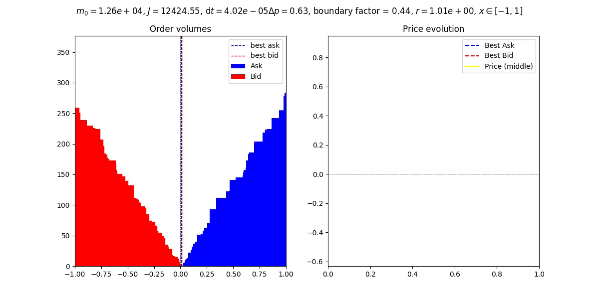

# LLOB: Locally Linear Order Book Simulations

Implementation of the Locally Linear Order Book model for market microstructure research, as introduced by Donier *et al.* in [A fully consistent, minimal model for non-linear market impact](https://arxiv.org/abs/1412.0141).

This codebase accompanies the article *"Market impact in a multiple metaorder landscape"* by Blanke, Moran, Crépin, Bouchaud, and Benzaquen.

## Installation

### Prerequisites

This project uses [uv](https://docs.astral.sh/uv/) for dependency management. Install uv first:

```bash
# macOS/Linux
curl -LsSf https://astral.sh/uv/install.sh | sh

# Or with Homebrew (macOS)
brew install uv

# Windows
powershell -ExecutionPolicy ByPass -c "irm https://astral.sh/uv/install.ps1 | iex"
```

After installation, restart your terminal or run `source ~/.bashrc` (or equivalent for your shell).

### Setting up the project

Clone the repository and install dependencies:

```bash
git clone <repository-url>
cd order-book

# Install all dependencies (creates a virtual environment automatically)
uv sync

# Or with dev dependencies (pytest, ruff, sphinx)
uv sync --group dev
```

That's it! `uv sync` creates a `.venv` directory and installs all dependencies.

## Running Scripts

Use `uv run` to execute Python scripts. This automatically uses the correct virtual environment:

```bash
# Run a paper figure script
uv run python paper/scripts/fig2.py

# Run experiments
uv run python depletion_scripts/exp1_sqrtimpact.py
uv run python depletion_scripts/exp2_density_profile.py --noise

# Run tests
uv run pytest

# Run linting
uv run ruff check llob/
```

You don't need to activate any virtual environment - `uv run` handles this automatically.

## Quick Start

### Basic simulation

```python
from llob import Simulation, standard_parameters

# Create simulation with standard parameters
params = standard_parameters(participation_rate=1.0, model_type='discrete')
sim = Simulation.from_params(**params)
sim.run()

print(f"Final price: {sim.prices[-1]}")
print(f"Final spread: {sim.spreads[-1]}")
```

### Using pydantic configs (preferred)

```python
from llob import Simulation, SimulationConfig, GridConfig

config = SimulationConfig(
    model_type='discrete',
    grid=GridConfig(xmin=-50, xmax=50, n_grid=100),
    D=1.0,
    L=1.0,
    duration=100.0,
    n_frames=100,
    metaorder=[0.5],  # Constant metaorder
)
sim = Simulation.from_config(config)
sim.run()
```

### Using from_params directly

```python
from llob import Simulation

sim = Simulation.from_params(
    model_type='discrete',
    duration=1000.0,
    n_frames=100,
    n_grid=1000,
    xmin=-500.0,
    xmax=500.0,
    D=0.5,
    L=10.0,
    nu=0.1,
    metaorder=[50],  # Constant metaorder m0=50
)
sim.run()
```

### Monte Carlo simulations

```python
from llob import MonteCarlo

mc = MonteCarlo(
    N_samples=100,
    noise_args={'m1': 50, 'hurst': 0.7},
    simulation_args={...},
)
mc.run()
results = mc.gather_results()
```

## Project Structure

```
order-book/
├── llob/                    # Main Python package
│   ├── __init__.py          # Public API exports
│   ├── simulation.py        # Simulation class
│   ├── monte_carlo.py       # Monte Carlo simulations
│   ├── books/               # Order book implementations
│   │   ├── discrete_book.py
│   │   ├── linear_discrete_book.py
│   │   ├── linear_continuous_book.py
│   │   └── multi_discrete_book.py
│   └── configs/             # Pydantic configuration classes
│       ├── simulation.py
│       ├── book.py
│       └── grid.py
├── paper/                   # Paper manuscript and figures
│   └── scripts/             # Figure generation scripts
├── depletion_scripts/       # Experiment scripts for depletion analysis
├── tests/                   # Test suite
├── pyproject.toml           # Project configuration
└── uv.lock                  # Locked dependencies
```

## Key Classes

| Class | Description |
|-------|-------------|
| `Simulation` | Main simulation orchestrator |
| `MonteCarlo` | Ensemble simulations with fractional Gaussian noise |
| `DiscreteBook` | Discrete order book with explicit limit orders |
| `LinearDiscreteBook` | Discrete book initialized with latent liquidity L |
| `LinearContinuousBook` | Continuous density approximation |
| `MultiDiscreteBook` | Multiple interacting order books |

## Simulation Parameters

Key parameters for `Simulation.from_params()`:

| Parameter | Description |
|-----------|-------------|
| `model_type` | `'discrete'` or `'continuous'` |
| `D` | Diffusion coefficient |
| `L` | Latent liquidity (scalar or list for multi-actor) |
| `nu` | Cancellation rate (default: 0). Required for spread-dependent deposition |
| `alpha` | Spread-dependent deposition sensitivity (default: 0) |
| `duration` | Total physical simulation time |
| `n_frames` | Number of output frames |
| `xmin`, `xmax` | Price grid boundaries |
| `n_grid` | Number of spatial grid points |
| `metaorder` | Array of metaorder intensities (length 1 for constant, or length n_frames) |
| `frame_start`, `frame_end` | Frame indices when metaorder is active |
| `price_formula` | `'middle'`, `'best_ask'`, `'best_bid'`, or `'vwap'` |

### Time convention

- `duration`: Physical simulation time (in arbitrary units)
- `n_frames`: Number of output frames/measurements
- `dt = duration / n_frames`: Time between output frames
- `dt_step = dx² / (2D)`: Elementary diffusion timestep (internal)

## Running Tests

```bash
# Run all tests
uv run pytest

# Run with verbose output
uv run pytest -v

# Run specific test file
uv run pytest tests/test_simulation.py
```

## Output

### Discrete book animation


## Requirements

- Python >= 3.11
- Dependencies managed via `uv` (see `pyproject.toml`)

## Authors

- Matthieu Blanke
- Jose Moran
