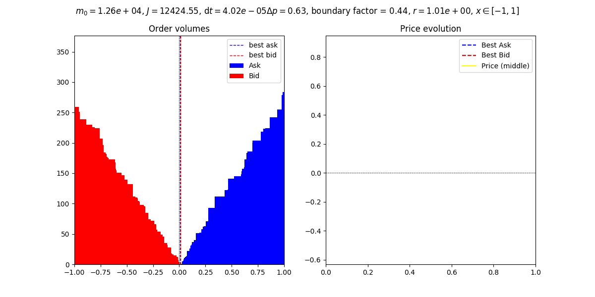

# LLOB model simulations

## Linearized Latent Order book simulations
Parent page of all the LLOB projects at  [the EconophysiX page](https://econophysix-confluence.atlassian.net/wiki/spaces/RES/pages/43679790/LLOBs).


The code in this page contains scripts for simulating the LLOB.


An implementation of the Locally Linear Order Book model as introduced by Donier *et al.* in the paper [A fully consistent, minimal model for non-linear market impact ](https://https://arxiv.org/abs/1412.0141).

Our code aims at modelling both the coarse-grained, *discrete* model, and the *continuous model* where the variable solved for is the algebraic order density.

## Structure of the code

Depending on the model, a locally linear order book is represented by an instance of either class `DiscreteBook` from `discrete_book.py` or class `ContinuousBook` from `continuous_book.py`.

A simulation can be created with class `Simulation` from `simulation.py` by inputting the model type and various simulation parameters.

Run the simulation with method `simulation.run()`. Display a `matplotlib` animation by setting argument `animation=True` and save it by setting `save=True`.

For noisy metaorders, Monte Carlo simulations can be performed with class MonteCarlo from `monte_carlo.py`.

## Discrete Order Book

An instance of `DiscreteBook` has two `orders` attributes which are instances of class `LimitOrders` and represent ASK and BUY orders respectively.
Class `LinearDiscreteBook` inherits from `DiscreteBook` and may be initialized with latent liquidity constant *L* instead of order deposition and cancellation constants.

## Continuous Order Book

This part of the code aims at solving order density reaction-diffusion equation under the assumptions of infinite memory.

Numerical scheme functions for diffusion equation are imported from `diffusion_schemes.py`.

## Simulation parameters

An instance of class `Simulation` is created with the following arguments
```python
{
	"model_type": model_type,
	"T": T,
	"Nt": Nt,
	"price_formula": price_formula,
	"Nx": Nx,
	"xmin": xmin,
	"xmax": xmax,
	"L": L,
	"D": D,
	"metaorder": [m0],
	"n_start" : n_start,
	"n_end" : n_end.
}
```

Class `Simulation` provides a function `standard_parameters` that generates standard parameters given a participation rate and a model type.

## Meta-orders
Input meta-order by setting the field `metaorder` in the previous parameters with an array. The array may either be of size Nt, or of size one, in which case its value is understood as that of a constant metaoroder.

## Run a sample simulation
Set parameters in `run.py` then run

```bash
cd Python
python run.py
```

### Automatic parameters settings

Function `standard_parameters` from `simulation.py` returns a dictionary of 'standard' parameters for one given participation rate r and one model type.


## Run a Monte Carlo simulation with a noisy meta-order

Perform a Monte Carlo simulation with an instance of class `MonteCarlo` from `monte_carlo.py`.

```Python
noisy_simulation = MonteCarlo(N_samples, noise_args, simulation_args)
noisy_simulation.run()
output = noisy_simulation.gather_results()
```

## Output

### Discrete book animation



## Requirements
* Python 3
* Modules numpy and matplotlib


The code for all types of simulations should be stored in a `.py` file defining the objects, such as classes with:

```python
class Simulation(object):

	def __init__(params):
		...... 


    def do_stuff():
		....
        
def helper_function(...):
    ...
```


So that simple simulation test and execution scripts can be written in a **separate file**, i.e.

```python
from object_definitions import Simulation, helper_function

def test_function(*params):
	sim = Simulation(*params)
	sim.do_stuff()
	measures = sim.gather_measures()
	return measures

params = ....
test = test_function(*params)
```
and then the results can be analyzed.

Test results, as well as parameters, can be stored on `pkl` files with the Pickle module.

