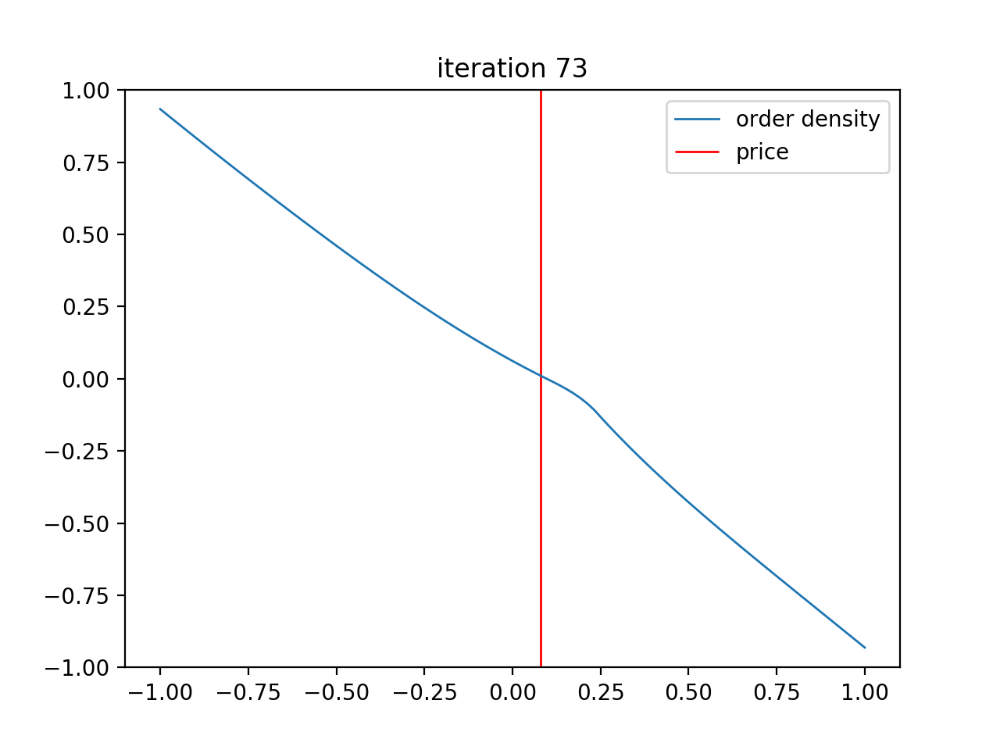
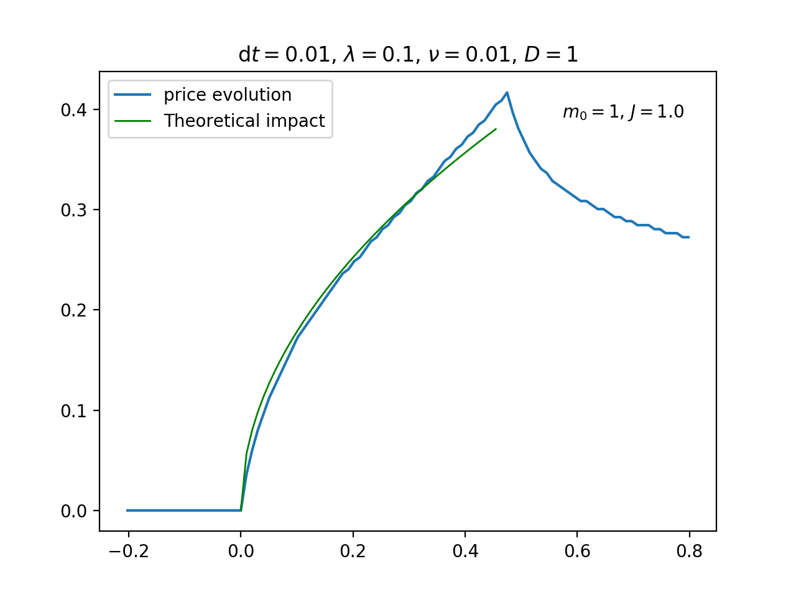
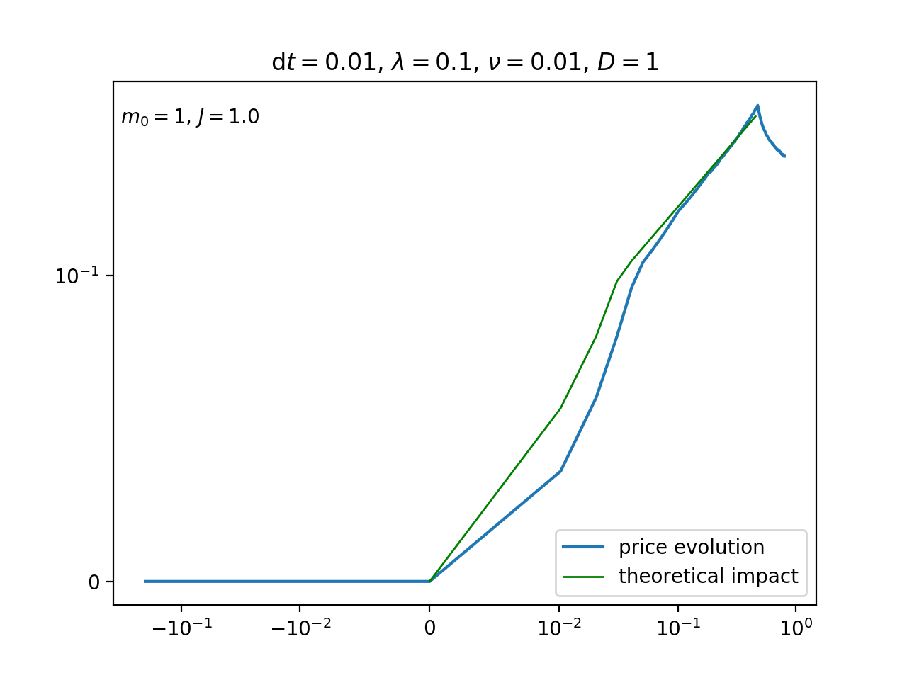

# Linear Latent Order Book simulation

## Requirements
* Python 3
* Modules numpy and matplotlib

## Structure of the code

An order book is represented by an instance of class `OrderBook` from `order_book.py`.
A simulation is represented by an instance of class `Simulation` from `simulation.py`.
Numerical scheme functions for diffusion equation are imported from `diffusion_schemes.py`.
A script setting parameters, running and plotting a simulation is provided in `run_simulation.py`.

Plots can be performed with `simulation.plot_...` methods.

Display an animation of the order book and of the price evolution using `simulation.run(animation=True)`. 


## Run a simulation
Set parameters in `run_simulation.py` then run

```bash
cd Python
python run_simulation.py
```

## Output



